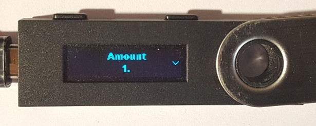
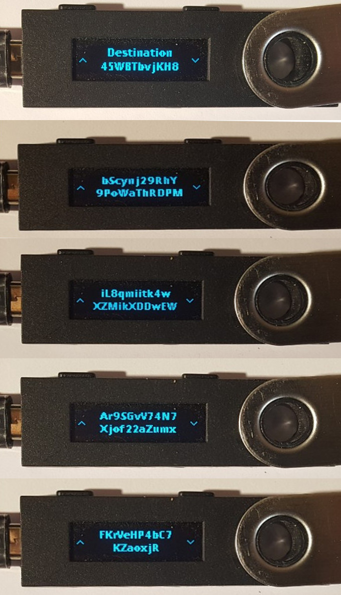

..
   Copyright (c) Electroneum Limited 2017-2020
   Copyright 2018 Cedric Mesnil <cslashm@gmail.com>, Ledger SAS
   Licensed under the Apache License, Version 2.0 (the "License");
   you may not use this file except in compliance with the License.
   You may obtain a copy of the License at
   http://www.apache.org/licenses/LICENSE-2.0 
   Unless required by applicable law or agreed to in writing, software
   distributed under the License is distributed on an "AS IS" BASIS,
   WITHOUT WARRANTIES OR CONDITIONS OF ANY KIND, either express or implied.
   See the License for the specific language governing permissions and
   limitations under the License.

..
   ------------------------------------------------------------------------
                         LaTex substitution Definition
   ------------------------------------------------------------------------

..
   ------------------------------------------------------------------------
                                     DOC
   ------------------------------------------------------------------------

License and Credits
===================

Authors: Christopher Harrison & Andre Patta

License:

  | Copyright (c) Electroneum Limited 2017-2020
  | Copyright 2018 Cedric Mesnil <cedric@ledger.fr>, Ledger SAS
  |
  | Licensed under the Apache License, Version 2.0 (the "License");
  | you may not use this file except in compliance with the License.
  | You may obtain a copy of the License at
  |
  |   http://www.apache.org/licenses/LICENSE-2.0
  |
  | Unless required by applicable law or agreed to in writing, software
  | distributed under the License is distributed on an "AS IS" BASIS,
  | WITHOUT WARRANTIES OR CONDITIONS OF ANY KIND, either express or implied.
  | See the License for the specific language governing permissions and
  | limitations under the License.

Credits:

This document is a modified version of an earlier work[1],
created by Cedric Mesnil <cslashm@gmail.com>, Ledger SAS <cedric@ledger.fr>                                                                             [1]

Introduction
============

How to install the Electroneum Application
------------------------------------------

This guide will explain how to use the Electroneum application for Ledger Blue and Nano S.

Nano S / Blue
-------------

For both, source and binary installation, use the most recent tag[2].

From Binary
~~~~~~~~~~~~~

Use the "Ledger Manager" Chrome App. See https://www.ledgerwallet.com/apps/manager for details.

As the "electroneum" application is still in beta stage the application is in developer section: click on "Show developers items" on the bottom right corner to see it.

   - Launch the Ledger Manager. See `Ledger Manager <https://www.ledgerwallet.com/apps/manager>`_  
     and  ` <https://ledger.groovehq.com/knowledge_base/topics/ledger-manager>`_ 
     for details about installing and using  the manager;
   - Connect your Nano S or your Blue, enter your PIN, and stay on the 
     dashboard;
   - Click on *show developer items* on the bottom right corner;
   - Click on the green bottom arrow icon near the Ledger *electroneum* logo;
   - Confirm the installation when required on your device by pressing the 
     right button above the checkmark;
   - Quit the Ledger Manager

The application is ready to use!

From source
~~~~~~~~~~~~~

Building from sources requires the the Nano S SDK og-1.6.0-1 on firmware 1.6.0+. See https://github.com/LedgerHQ/nanos-secure-sdk

Refer to the SDK documentation for the compiling/loading...

System Configuration
--------------------

Linux
~~~~~

The following packages must be installed: pcsc-tools pcscd libpcsclite1:amd64 .

You have to have to add the NanoS to /etc/libccid_Info.plist

    In  <key>ifdVendorID</key>      add the entry  <string>0x2C97</string>
    In  <key>ifdProductID</key>     add the entry  <string>0x0001</string>
    In  <key>ifdFriendlyName</key>  add the entry  <string>Ledger Token</string>
  
These 3 entries must be added at the end of each list.

MAC
~~~

The SmartCard service must be installed. See https://smartcardservices.github.io/

1. First it is necessary to [disable SIP](https://developer.apple.com/library/mac/documentation/Security/Conceptual/System_Integrity_Protection_Guide/ConfiguringSystemIntegrityProtection/ConfiguringSystemIntegrityProtection.html) That doesn't allow the editing of files in /usr/.

2. You have to add the Nano S to /usr/libexec/SmartCardServices/drivers/ifd-ccid.bundle/Contents/Info.plist

       In  <key>ifdVendorID</key>      add the entry  <string>0x2C97</string>
       In  <key>ifdProductID</key>     add the entry  <string>0x0001</string>
       In  <key>ifdFriendlyName</key>  add the entry  <string>Ledger Token</string>
  
These 3 entries must be added at the end of each list.

3. [Enable SIP](https://developer.apple.com/library/content/documentation/Security/Conceptual/System_Integrity_Protection_Guide/ConfiguringSystemIntegrityProtection/ConfiguringSystemIntegrityProtection.html)

Windows
~~~~~~~

SmartCard service should be already installed. However you might have to start it.

Nano S Electroneum Application Explained
========================================

Menu Overview
-------------

The full menu layout is :

| \ *Device Info*
| Settings
|       Change Network
|             \ *It will reset the application*
|             Abort
|             Test Network
|             Stage Network
|             Main Network
|       Reset
| About 
|      \ *electroneum*
|      \ *(c) Ledger SAS*
|      \ *Spec x.y*
|      \ *App x.y.z*
| Quit app

| Emphasis entries are not selectable and just provide information. 
| A "**+**" after the entry label means current value.

Device Info
-------------

The *Device Info* provides current user and slot information. The format is:

|      <electroneum: public key >

Settings
--------

Change Network
~~~~~~~~~~~~~~

Change the network pairing of the application. Some versions maybe locked to Test or Stage network.

Reset
~~~~~

Selecting the menu will erase all electroneum Application data and will
reset the application in its '*just installed*' state.
 

Nano-S Electroneum Card application usage
=========================================

Electroneum
-----------

The electroneum application is intended to be used with electroneum-wallet-cli 3.2.0.0+ on v8 network[3].

Future compatibility will be outlined in the Ledger repo's README.

Today, the following feature are supported:

- Creating
- Restoring wallet
- Send Funds
- Receive Funds
- Sub-address

The following commands are NOT supported:

- specific send:
    - submit_transfer 
    - transfer_original 
- import/export:
    - import_key_images 
    - export_key_images 
    - import_outputs 
    - export_outputs 
- multi-sig:
    - make_multisig 
    - prepare_multisig 
    - export_raw_multisig_tx 
    - sign_multisig 
    - finalize_multisig 
    - import_multisig_info 
    - export_multisig_info 
    - submit_multisig 
- proof generation
    - get_reserve_proof 
    - get_spend_proof 
    - get_tx_proof 
- misc
    - get_tx_key 
    - sign 
    - sign_transfer 
    - verify

Those command are planned to be added in future versions

Creating/Restoring Wallet
~~~~~~~~~~~~~~~~~~~~~~~~~

Creating or Restoring a wallet is done in the same manner, as the key comes from the Device.

The basic command is ``electroneum-wallet-cli --generate-from-device </path/to/wallet/directory>``

When doing this you get a message telling you are creating a new wallet.

This means that the restore height will be set to the current network height and all
previous blocks will not be scanned for incoming transactions.

If you want to restore a wallet that already has past inbound transactions you have to restore
from a specific provided height. Why do not simply restore from genesis?
Because Electroneum is a special network in which all transactions are
fully encrypted. That means the only way to know if a block contains a transaction for you is to decrypt
that transaction. Start from genesis will implies decrypting the whole blockchain on the device.
This will take a very long time.

Finally there is a last option that should be used: ``--subaddress-lookahead <Major:minor>``. By default
when creating a wallet, the client pre-computes the first 200 addresses for the first 50 accounts
50:200. This setup take around 25 minutes. You can drastically reduce this time by using something like
`10:50`,

Finally a suggested command for creating a wallet is:

    electroneum-wallet-cli --generate-from-device </path/to/wallet/file> --subaddress-lookahead 10:50

adapted this command adapted to scan from a specific height :

    electroneum-wallet-cli --generate-from-device </path/to/wallet/file> --restore-height <height> --subaddress-lookahead 10:50

**Note 1**: 

Your device must be plugged into your computer with the Electroneum application launched BEFORE running the wallet.
Once the wallet is running DO NOT quit the application nor unplug the device.

**Note 2**: 

Read the *Launching an existing wallet* about viewkey disclosure.

Launching an existing wallet
~~~~~~~~~~~~~~~~~~~~~~~~~~~~

Plug your device and launch the Electroneum application.

Launch your wallet as usual:

    electroneum-wallet-cli --wallet-file </path/to/wallet/file>

On startup, the device requests that you authorize the export of the private view key to the wallet client.
Accepting this request makes the block scan for incoming transactions faster. In this mode
only your incoming transactions will be sent to the device for decryption. If you do not accept, ALL
transactions, even those not for your wallet, will be sent to the device for review. Rejecting this disclosure
 is more confidential however.

Sending Funds
~~~~~~~~~~~~~

Use  the *transfer* command and check your device for a prompt to accept/reject fee, amount and destination.

Here is an example with some screenshots:

**Initial command**

    [wallet etnkff1]: transfer etnjxEaDFwiEFc1UqjEDF4eSrmpvM4n4xWv7eWp6Qv6
    rF7uhEpnzWrEFzKyxBzQQ5WeXtnmg1BrP75xoPSikt2NL7Y2HGLAohs 1

    Wallet password: 

**NanoS Interaction**

After entering your password, the client will prepare the transaction. Depending on your wallet and the number of destinations
it may take a while.
Once the transaction is prepared, the device will ask you to validate some information:

*Fee*

.. image:: fee.png
    :align: middle

Check if you're ok with what is displayed and then scroll down and select either "Accept" or "Reject".

*Amount and destination*

Then for each destination you have to check the amount being sent

and corresponding destination.

Again check if you're ok with this, scroll down, and select either "Accept" or "Reject".

**Final client interaction**

Once fees and all destinations have been validated, the transaction is signed and a final agreement must be done on the
client command line:

   | Transaction 1/1:
   | Spending from address index 0
   | Sending 1.00.  The transaction fee is 0.10
   | Is this okay?  (Y/Yes/N/No): y
   | Transaction successfully submitted, transaction <834251315043845c44429fa331f564fadedc841ec6f32945059275e137c5066a>
   | You can check its status by using the `show_transfers` command.
   | [wallet etnkff1]: 

Annexes
=======

References
----------

* [1] *Original Document* https://github.com/LedgerHQ/ledger-app-monero/tree/master/doc/user/
* [2] *Ledger App Github* https://github.com/electroneum-project/electroneum
* [3] *Blockchain Github* https://github.com/electroneum/electroneum
